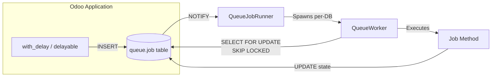
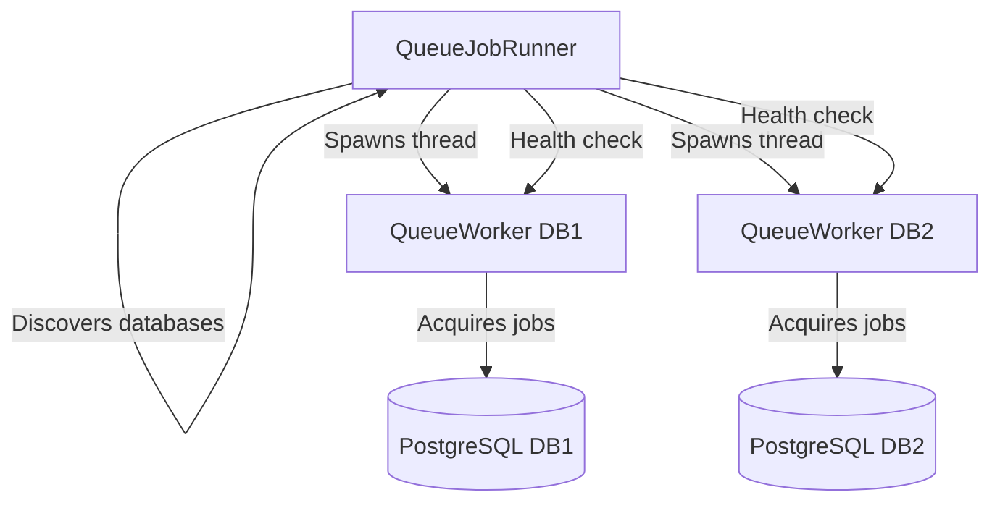

# Odoo Job Worker

**High-performance, SQL-driven background job engine for Odoo.**

!!! warning "Pre-Release Software"
    This project is under active development and has not yet undergone the level of
    testing and review required for production use. APIs, field names, and behaviors
    may change without notice. Use in staging and development environments, and
    expect breaking changes until a stable release is announced.

Odoo Job Worker replaces traditional cron-based or memory-resident job queues with a
PostgreSQL-native architecture built on `FOR UPDATE SKIP LOCKED` and `LISTEN/NOTIFY`.
Jobs are durable rows in the database — no broker, no Redis, no external dependencies
beyond PostgreSQL.

## Features

- **SQL Pull Architecture** — Workers acquire jobs atomically with `SELECT ... FOR UPDATE SKIP LOCKED`. No double-execution, no message loss.
- **Instant Wakeup** — PostgreSQL `LISTEN/NOTIFY` triggers workers the moment a job is enqueued. No polling delay.
- **Per-Channel Throttling** — Concurrency limits and rate limiting (jobs/second) per channel via `queue.limit` records.
- **Job Graphs** — `group()` for fan-out parallelism, `chain()` for sequential pipelines, `on_done()` for callbacks.
- **Heartbeat & Timeout** — Workers send heartbeats during execution. Stale jobs are automatically recovered. Per-job timeouts are enforced.
- **Familiar API** — `with_delay()`, `delayable()`, `group()`, and `chain()` — compatible with OCA `queue_job` patterns.
- **Multi-Database Runner** — A single runner process discovers databases and manages per-database worker threads.
- **Dashboard & Alerts** — The `job_worker_monitor` module provides a real-time dashboard, metrics collection, and configurable alert rules.

## Modules

| Module | Description |
|---|---|
| **job_worker** | Core queue engine — job model, worker, delay API, channel throttling |
| **job_worker_monitor** | Dashboard, metrics, and alert rules for queue operations |
| **job_worker_demo** | Interactive demo companion for exploring the queue system |

## Requirements

- **Odoo 19.0**
- **PostgreSQL 12+** (including PostgreSQL 18)

## Quick Start

```python
# Enqueue a job with one line
partner.with_delay(channel="exports", priority=5).write({"name": "Updated"})
```

See [Getting Started](getting-started.md) for installation and your first job.

## Architecture Overview



### Worker / Runner Relationship


