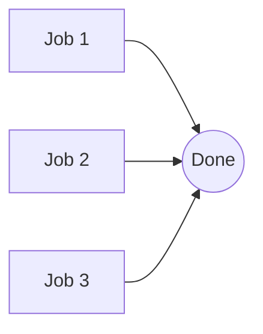
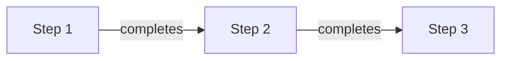
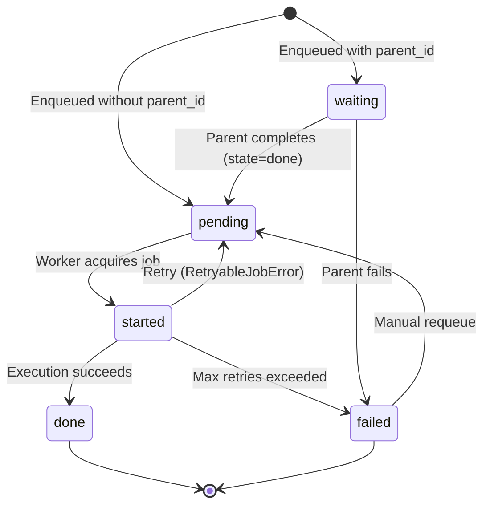

# Job Graphs

Job graphs let you compose multiple jobs with dependency relationships. Jobs in a
graph share a `graph_uuid` and use `parent_id` to track execution order.

## Groups (Fan-Out)

A `group()` enqueues multiple jobs that execute in parallel:

```python
from odoo.addons.job_worker.delay import group

g = group(
    record1.delayable().do_work(),
    record2.delayable().do_work(),
    record3.delayable().do_work(),
)
g.delay()
```

All jobs start in `pending` state and are picked up by workers as capacity allows.



## Chains (Sequential Pipeline)

A `chain()` enqueues jobs that execute one after another:

```python
from odoo.addons.job_worker.delay import chain

c = chain(
    record.delayable().step_one(),
    record.delayable().step_two(),
    record.delayable().step_three(),
)
c.delay()
```

The first job starts in `pending` state. Subsequent jobs start in `waiting` state and
move to `pending` when their parent completes successfully.



!!! warning "Chain failure"
    If a job in a chain fails permanently (retries exhausted), waiting child jobs are
    marked `failed`. Requeue or recreate downstream jobs after fixing the root cause.

## Callbacks with `on_done()`

Use `on_done()` to trigger a callback job after the main job completes:

```python
main = record.delayable().do_heavy_work()
callback = record.delayable().notify_done()
main.on_done(callback)
main.delay()
```

The callback job starts in `waiting` state and moves to `pending` when the main job
finishes successfully.


### Multiple Callbacks

You can attach multiple callbacks:

```python
main = record.delayable().do_heavy_work()
main.on_done(
    record.delayable().send_email(),
    record.delayable().update_dashboard(),
)
main.delay()
```

## Splitting Recordsets

`split()` breaks a large recordset into chunked jobs:

```python
delayable = large_recordset.delayable(channel="export")
delayable.do_export()

# Parallel chunks (group)
chunked_group = delayable.split(100)
chunked_group.delay()

# Sequential chunks (chain)
chunked_chain = delayable.split(100, chain=True)
chunked_chain.delay()
```

Each chunk operates on a subset of the original recordset (up to `size` records per
chunk).

## Combining Patterns

Supported compositions:

```python
from odoo.addons.job_worker.delay import group, chain

# Independent fan-out
group(
    batch1.delayable().do_export(),
    batch2.delayable().do_export(),
    batch3.delayable().do_export(),
).delay()

# Sequential pipeline
chain(
    record.delayable().prepare_data(),
    record.delayable().process_data(),
    record.delayable().finalize(),
).delay()

# Per-job callback
record.delayable().do_work().on_done(
    record.delayable().log_completion(),
).delay()
```

!!! note "Current limitation"
    `DelayableChain` expects `Delayable` steps. Putting a `group()` inside `chain()`,
    or using `DelayableGroup.on_done()`, does not create a wait-for-all dependency
    barrier.

## How It Works



- Jobs in a graph share a `graph_uuid` (auto-generated UUIDv4)
- Chain dependencies use `parent_id` — each job points to its predecessor
- When a parent job transitions to `done`, its children move from `waiting` to `pending`
- When a parent job transitions to `failed`, its children also move to `failed`
