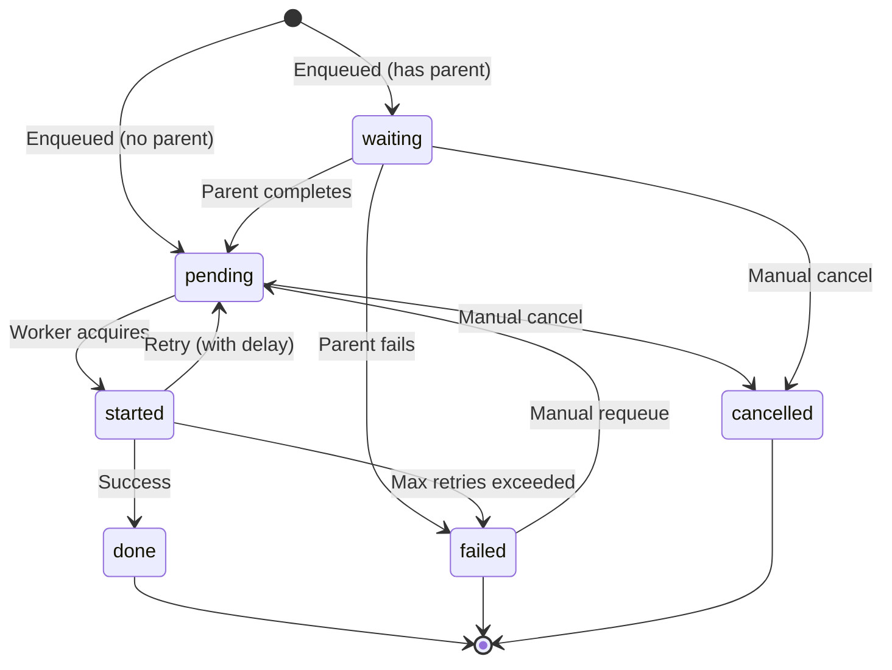

# API Reference

## Job States



| State | Description |
|---|---|
| `pending` | Ready to be acquired by a worker |
| `waiting` | Blocked on a parent job (graph dependency) |
| `started` | Currently being executed by a worker |
| `done` | Completed successfully |
| `failed` | Failed after exhausting retries or permanent error |
| `cancelled` | Manually cancelled by a user |

## Job Fields

### Core Fields

| Field | Type | Description |
|---|---|---|
| `uuid` | `Char` | Auto-generated UUIDv4 identifier |
| `name` | `Char` | Human-readable description |
| `state` | `Selection` | Current job state |
| `payload` | `Json` | Serialized method call: model, method, ids, args, kwargs |
| `result` | `Json` | Serialized return value (max 64 KB) |
| `channel` | `Char` | Channel name for throttling |
| `priority` | `Integer` | Execution priority (lower = higher priority, default: 10) |

### Timing Fields

| Field | Type | Description |
|---|---|---|
| `scheduled_at` | `Datetime` | Earliest execution time |
| `started_at` | `Datetime` | When execution began |
| `completed_at` | `Datetime` | When execution finished |
| `cancelled_at` | `Datetime` | When the job was cancelled |
| `duration` | `Float` | Execution time in seconds |

### Retry Fields

| Field | Type | Description |
|---|---|---|
| `attempts` | `Integer` | Current attempt count |
| `max_retries` | `Integer` | Maximum attempts (0 = infinite, default: 5) |
| `exc_info` | `Text` | Exception traceback from the last failure |
| `timeout` | `Integer` | Per-job timeout in seconds (0 = no timeout) |

### Worker Fields

| Field | Type | Description |
|---|---|---|
| `heartbeat` | `Datetime` | Last heartbeat from the processing worker |
| `worker_id` | `Char` | UUID of the processing worker |

### Graph Fields

| Field | Type | Description |
|---|---|---|
| `parent_id` | `Many2one` | Parent job in a chain |
| `child_ids` | `One2many` | Child jobs (dependents) |
| `graph_uuid` | `Char` | Groups related jobs from a single `delay()` call |

### Computed Fields

| Field | Type | Description |
|---|---|---|
| `model_name` | `Char` | Target model (extracted from payload) |
| `method_name` | `Char` | Target method (extracted from payload) |
| `func_string` | `Char` | Display string: `model.method([ids])` |
| `record_ids` | `Json` | Target record IDs (extracted from payload) |
| `identity_key` | `Char` | Deduplication key |
| `duration_bucket` | `Selection` | Categorized execution time (instant/fast/moderate/slow/very_slow) |

### Compatibility Aliases

These fields map to their OCA `queue_job` equivalents for backward compatibility:

| Alias | Maps to |
|---|---|
| `date_created` | `create_date` |
| `date_started` | `started_at` |
| `date_done` | `completed_at` |
| `date_cancelled` | `cancelled_at` |
| `exec_time` | `duration` |
| `eta` | `scheduled_at` |
| `retry` | `attempts` |

## Exceptions

### `JobError`

Base exception for all job-related errors.

```python
from odoo.addons.job_worker.exception import JobError
```

### `RetryableJobError`

Raised inside a job method to request a retry:

```python
from odoo.addons.job_worker.exception import RetryableJobError

raise RetryableJobError(
    "Service unavailable",
    seconds=120,        # fixed retry delay (overrides exponential backoff)
    ignore_retry=True,  # don't count this attempt toward max_retries
)
```

| Parameter | Type | Default | Description |
|---|---|---|---|
| `msg` | `str` | (required) | Human-readable error message |
| `seconds` | `int` | `None` | Fixed retry delay in seconds |
| `ignore_retry` | `bool` | `False` | If `True`, attempt not counted toward `max_retries` |

### `FailedJobError`

Available as a semantic marker for permanent/business failures:

```python
from odoo.addons.job_worker.exception import FailedJobError

raise FailedJobError("Invalid configuration — cannot proceed")
```

Current behavior: `QueueWorker` does not special-case `FailedJobError`; it follows
the standard non-`RetryableJobError` retry flow based on `max_retries`.

### `TimeoutJobError`

Exception class used to label timeout failures:

```python
from odoo.addons.job_worker.exception import TimeoutJobError
```

On timeout, the worker updates job state internally and writes
`TimeoutJobError: ...` into `exc_info`; timeout handling then follows the standard
retry logic unless `max_retries` is exhausted.

## Constants

```python
from odoo.addons.job_worker.job import (
    DEFAULT_PRIORITY,      # 10
    DEFAULT_MAX_RETRIES,   # 5
    DEFAULT_TIMEOUT,       # 0 (no timeout)
    PENDING,               # "pending"
    WAITING,               # "waiting"
    STARTED,               # "started"
    DONE,                  # "done"
    FAILED,                # "failed"
    CANCELLED,             # "cancelled"
)
```

## Public Methods

### `queue.job` Model

| Method | Description |
|---|---|
| `enqueue(model_name, method_name, record_ids, args, kwargs, ...)` | Create and enqueue a job |
| `run_now()` | Execute the job immediately in the current transaction |
| `button_requeue()` | Reset to `pending`, clear attempts/error, wake worker |
| `button_set_to_done()` | Manually mark as completed |
| `button_set_to_failed()` | Manually mark as failed |
| `open_related_action()` | Open the target record(s) in Odoo |

### `base` Model Extensions

| Method | Description |
|---|---|
| `with_delay(**options)` | Enqueue a method call immediately |
| `delayable(**options)` | Create a `Delayable` for composition before enqueuing |
| `_job_store_values(job_vals)` | Hook to inject custom values into job records |

### `Delayable` Class

| Method | Description |
|---|---|
| `delay()` | Enqueue the captured method call, return `queue.job` record |
| `split(size, chain=False)` | Split recordset into chunked group or chain |
| `on_done(*delayables)` | Attach callback jobs to execute after this job completes |

### Utility Functions

| Function | Module | Description |
|---|---|---|
| `group(*delayables)` | `job_worker.delay` | Create a parallel group |
| `chain(*delayables)` | `job_worker.delay` | Create a sequential chain |
| `identity_exact(delayable)` | `job_worker.job` | SHA-1 hash of model, method, ids, args, kwargs |

## Security Groups

| XML ID | Name | Permissions |
|---|---|---|
| `job_worker.group_queue_job_user` | Queue Job User | View and operate own jobs |
| `job_worker.group_queue_job_manager` | Queue Job Manager | User permissions + view all jobs + channel configuration |

## Database Indexes

| Index | Purpose |
|---|---|
| Partial unique on `identity_key` (active states) | Deduplication enforcement |
| `completed_at` (where not null) | Job cleanup queries |
| `channel, completed_at` (where not null) | Channel-scoped reporting |
